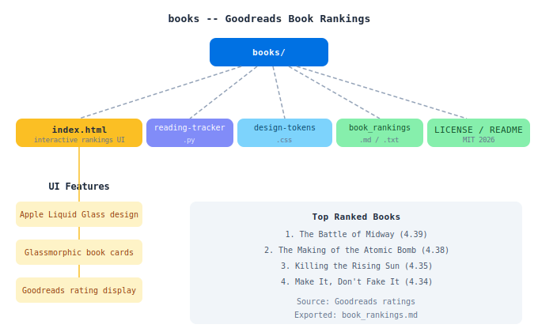

# Books

 

A curated collection of book rankings based on Goodreads ratings and reviews.
Live at [books.heyitsmejosh.com](https://books.heyitsmejosh.com).

## Files

- `index.html` - Interactive book rankings with Apple Liquid design. Top section tracks library checkouts with a live due-date countdown (edit the `data-due` attribute on `#deadline` and the `.library` list to update).
- `book_rankings.md` - Markdown version of the rankings
- Images of all books in the collection

## View the Rankings

Open `index.html` in your browser to view the interactive rankings with a beautiful glassmorphic UI.

## Top 5 Books

1. The Battle of Midway (4.39/5)
2. The Making of the Atomic Bomb (4.38/5)
3. Killing the Rising Sun (4.35/5)
4. Make It, Don't Fake It (4.34/5)
5. American Prometheus (4.32/5)

## Project Map

## Roadmap

- [x] iOS companion — `ios/BooksApp` is a thin WKWebView wrapper around the live site (no native rebuild needed)
- [ ] Mac companion — no target yet, add via `xcodegen` in `ios/` once iOS wrapper is confirmed working
- [ ] Supabase/profiles — no backend exists; only worth adding if the app needs per-user state (e.g. personal TBR/read status). Until then the site stays static, no auth needed
- [ ] Goodreads sync — no API integration; rankings are hand-curated in `book_rankings.md` + `index.html` (kept in parallel, see `CLAUDE.md`). Goodreads' public API has been closed to new keys for years — would need scraping or a manual export, not a live sync

